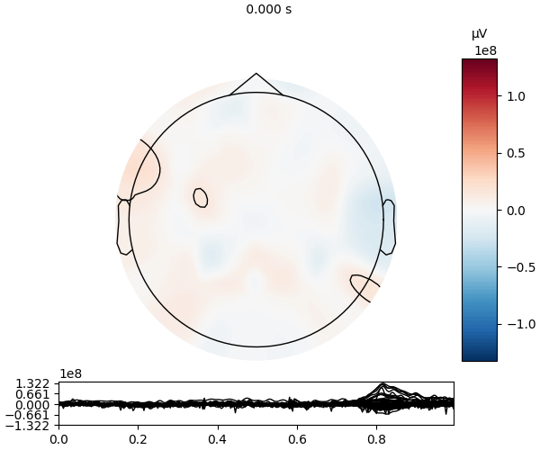
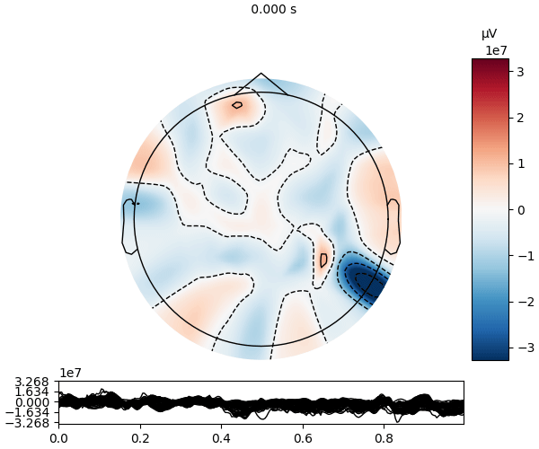
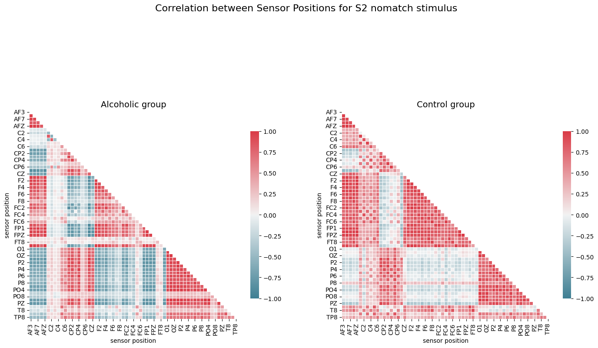

## Repo description
This repo contains the analysis of the alcoholic data of EEG signals.

### Structure. 
- exploration_mne_egg — explorating of signals with MNE library
- stat_analysis — statistical analysis of the signals
- traning_eeg_data — training of the model to predict the stimulus from the EEG data

#### exploration_mne_egg
Impressive visualization of single trial for both type participants (control and alcoholic).

##### Alcoholic

##### Control

### stat_analysis
Correlation analysis. 

### traning_eeg_data
Experimental model which include CNN Model and FFT transofmration after conv layer. 

Did't work out, will be updated soon. 

Probably something went wrong with the data preprocessing. 